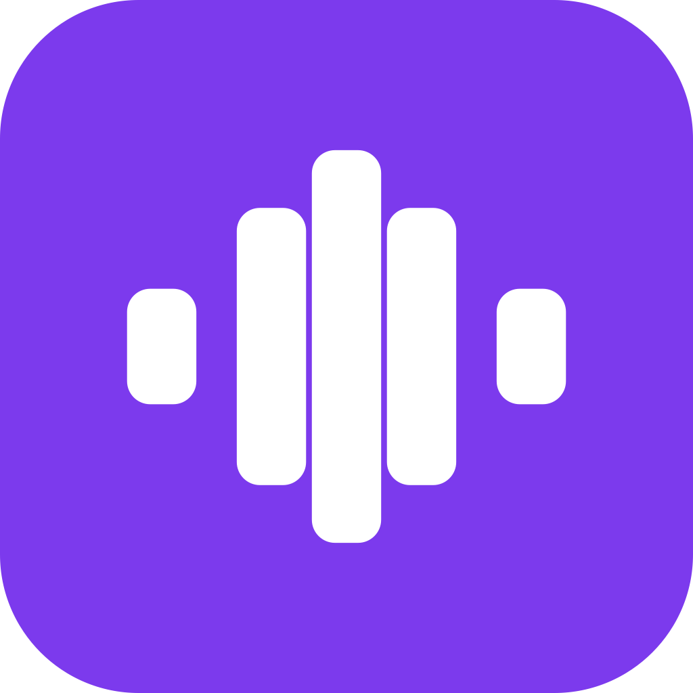

<!-- ai-processed:unverified | session:01a0f5ce-3321-7bd1-9738-1f28ad96ef6b | date:2026-10-01 -->
<p align="center">
  
</p>

<h1 align="center">speakfree</h1>

<p align="center">
  Hold a key, speak, release — your words appear at the cursor.<br>
  Local dictation. No account required for speech recognition. Free forever.<br>
  <sub>Speech recognition runs on your Mac. Optional Claude cleanup sends text to Claude; model downloads and update checks also use the network.</sub>
</p>

<p align="center">
  <strong>🌐 Website &amp; downloads: <a href="https://definitelyreal.github.io/speakfree/">definitelyreal.github.io/speakfree</a></strong>
</p>

<p align="center">
  <a href="https://github.com/definitelyreal/speakfree/releases/latest"></a>
  
  
</p>

---

## Install

1. Download **[speakfree.dmg](https://github.com/definitelyreal/speakfree/releases/latest)** and open it
2. Drag **speakfree.app** to your Applications folder
3. Open it — **right-click → Open** on the first launch (macOS security step, required once)
4. Grant **Microphone** and **Accessibility** permissions when prompted
5. On first launch, a window appears to download the speech model — **NVIDIA Parakeet (English)** by default, ~600 MB one-time

The speakfree icon appears in your menu bar when it's running.

### Alpha builds

The public repository is open to everyone; you do not need a collaborator invitation to test.
Use a release explicitly marked **Pre-release** with an attached signed, notarized DMG.
A branch or GitHub's automatic source ZIP is source code, not an installable app.
See [alpha testing and distribution](docs/alpha-testing.md) for installation, feedback,
and manual alpha updates. Until an alpha asset is published, the latest
stable release above remains the public download.

> **Requires macOS 14 or later on Apple Silicon (M1 or newer).** Intel Macs are not supported — the default Parakeet engine runs on the Neural Engine, and the build links Apple-Silicon Homebrew paths. Older releases ran on macOS 13, but this version moves the minimum up to 14. If you're on macOS 13, the last release that supports you is the previous one — you won't receive updates past it.

## Usage

**Hold** the Globe key (🌐, bottom-left of keyboard), **speak**, then **release**.

Your words are typed wherever your cursor is. If no text field is focused, the transcription is copied to your clipboard instead.

## Settings

Click the menu bar icon → **Settings** to change everything in-app:

| Setting | Options |
|---|---|
| **Hotkey** | Globe 🌐, Left/Right Command ⌘, Left/Right Option ⌥, Left Control ⌃ |
| **Engine & model** | Parakeet English (default), or any Whisper size (see below) |
| **Punctuation** | Hybrid (default), Off, Spoken words |
| **Key Mode** | Hold (default), Toggle |
| **Past Recordings** | Keep everything (default), or cap at the last 10–100 |

Click **Help** in the menu for plain-English explanations of every setting.

## Microphones and the AirPods tradeoff

speakfree records from your Mac's own microphone by default (on a Mac without one, the wired mic you have). You can pin any mic in **Settings → Microphone**, or pick one under **Change to** in the menu; a pinned mic stays pinned when you join a call or plug in headphones.

AirPods and other Bluetooth headsets deserve an honest note, because no Mac dictation app can make them free:

- **Bluetooth makes you choose.** A Bluetooth headset only carries its microphone in its call mode. The moment any app records from it, music and video on the headset drop to phone-call quality, and they stay that way until the mic is released. AirPods may also switch over from your iPhone to the Mac. Apple offers a fix for this on iPhone, but not to Mac apps.
- **Accuracy is situational.** In a quiet room the Mac's own mic does at least as well. In a noisy place (a plane, a café, a street) the headset mic, which sits by your mouth, can be the best microphone you have.
- **Connecting is not choosing.** macOS makes every headset the default input the moment it connects, often while you only meant to listen to something.

So speakfree never uses a headset just because it connected. When you want it, choose **Stay on AirPods Pro** (or whatever your headset is called) in the menu. One click keeps dictation on that headset for 2 hours; **Other durations** has 1, 6 or 24 hours, until you turn it off, until the Mac sleeps for 20 minutes, or until restart. While it is on, the menu says so and shows when it ends, the menu-bar icon carries a small headset badge, and music on the headset sounds like a phone call. If the headset disconnects, Stay on waits for it to come back instead of ending, and it ends on its own when its time is up. Picking another mic or **End Stay on** ends it early.

One automatic behavior, and it is narrow: if a dictation of 8 seconds or more in a noisy room comes back nearly empty and a headset with a mic is connected, speakfree switches to it for 2 hours and tells you, with **Undo**. It asks instead of switching when music or video is playing on the headset, when you have pinned a different mic, or for a day after you pressed Undo. The lost dictation stays in Recent Dictations if you save recordings.

## Transcription engines

speakfree can transcribe with one of two local engines. Both perform speech recognition on your Mac, without uploading audio to a transcription service.

| Engine | Parakeet (default) | Whisper |
|---|---|---|
| Maker | NVIDIA | OpenAI (via whisper.cpp) |
| Runs on | Apple Neural Engine | CPU / Metal GPU |
| Speed & accuracy | Higher | Good |
| Live preview | No — text appears when you release | Yes — words appear as you speak |
| Download | ~600 MB, one-time | 75 MB – 3 GB (see Models) |
| Requires | macOS 14+ | macOS 14+ |

**Parakeet** is the default: NVIDIA's speech model running on the Apple Neural Engine — faster and more accurate than Whisper for English. The default model is the English-only variant (`parakeet-tdt-0.6b-v2`); choosing a non-English language switches to the multilingual variant (v3). Parakeet does **not** show a live preview — your text appears all at once when you release the key.

**Whisper** is the alternative if you want a live preview of your words as you speak, or a smaller download — it offers a range of model sizes (see [Models](#models)).

Switch engines in **Settings**. Models download automatically the first time you select them.

## Models

These are the **Whisper** model sizes, for when you switch off the default Parakeet engine. Larger models are more accurate but take longer to transcribe. (Parakeet uses a single ~600 MB model — see [Transcription engines](#transcription-engines).)

| Model | Size | Speed | Best for |
|---|---|---|---|
| tiny.en | 75 MB | Fastest | Quick notes, short phrases |
| base.en | 142 MB | Fast | Small download, decent accuracy |
| small.en | 466 MB | Moderate | Technical terms, longer dictation |
| medium.en | 1.5 GB | Slower | High accuracy |
| **large-v3-turbo** | **1.5 GB** | **Fast** | **Whisper default — best accuracy/speed balance** |
| large | 3 GB | Slowest | Best accuracy (M1 Pro+ recommended) |

Switching models downloads automatically if needed.

## Use speakfree from AI assistants

speakfree includes a skill for **Claude Code** and **Codex**, so your assistant can use the
app you already have. Once it's installed you can ask things like "transcribe
~/Desktop/memo.m4a", "what did I dictate into Mail just now?", or "add Priya Raman to my
speakfree vocabulary".

What the skill can do:

- **Transcribe an audio file** on your Mac. No network, no model downloads.
- **Read your recent dictations**, optionally only those typed into one app. Your
  dictation history is private, so this works **only if you've turned on saving** in
  Settings (Keep Recordings & Transcripts). With saving off, it reads nothing and says so.
- **List, add, or remove words** in your custom vocabulary (the same file Settings opens).

Nothing is installed until you run the installer yourself. From a clone of this repo:

```bash
bash scripts/install-agent-skills.sh install          # Claude Code and Codex
bash scripts/install-agent-skills.sh install claude   # or just one
bash scripts/install-agent-skills.sh remove           # take it back out
```

This copies one file, `SKILL.md`, to `~/.claude/skills/speakfree/` (Claude Code) and
`~/.agents/skills/speakfree/` (Codex). Without a clone, download
[integrations/claude-code/speakfree/SKILL.md](integrations/claude-code/speakfree/SKILL.md)
and put it in one of those folders. Start a new assistant session afterward.

Scripts and other tools can call the same commands directly
(`/Applications/speakfree.app/Contents/MacOS/speakfree transcribe <file>`, `history`,
`vocab`); each prints one JSON object. The full contract, including exit codes, is in
[docs/AGENT-CLI.md](docs/AGENT-CLI.md).

### Let the AI see what the engine heard (experimental, off by default)

When a dictated prompt comes out wrong ("Kama" for "comma"), the assistant only sees the
wrong word. speakfree can pass along what the speech engine actually heard: an optional
**dictation trace** (one dot after each dictation in AI and coding apps, carrying the raw
engine text invisibly), a **Claude Code / Codex hook** that adds it as context for every
dictated prompt, and `speakfree match`, which finds the dictations a piece of text came
from. The trace puts your raw spoken words into the app you dictate into, so it is off by
default and never used in chat or mail apps. Details, privacy notes, and a two-minute test
of which apps keep the invisible characters: [docs/DICTATION-TRACE.md](docs/DICTATION-TRACE.md).

## Privacy

speakfree's speech recognition runs on your Mac.

- Local speech recognition does not upload your recordings to a transcription service.
- Optional Claude cleanup sends raw and processed dictation text with repair instructions through your signed-in Claude command line tool. It requires Claude access and is separate from local speech recognition.
- Model downloads and update checks use the network. Update checks do not send dictation audio or text.
- Dictating or pasting into another app gives that app the resulting text; its own storage and network behavior apply.
- Audio is transcribed locally. Recordings are kept on your Mac (`~/.config/speakfree/recordings`) so you can review past dictations — cap or delete them anytime in Settings

## Build from source

Apple Silicon only — `Package.swift` links whisper-cpp from the Apple-Silicon Homebrew prefix (`/opt/homebrew`), so Intel Macs cannot build this project.

```bash
git clone https://github.com/definitelyreal/speakfree.git
cd speakfree
brew install whisper-cpp
swift build -c release
bash scripts/bundle-app.sh .build/release/speakfree speakfree.app dev
open speakfree.app
```

## Credits

Forked from [open-wispr](https://github.com/human37/open-wispr) by [human37](https://github.com/human37). Powered by [whisper.cpp](https://github.com/ggml-org/whisper.cpp).

Parakeet speech recognition powered by [NVIDIA Parakeet](https://huggingface.co/nvidia/parakeet-tdt-0.6b-v3) (CC-BY-4.0) via [FluidAudio](https://github.com/FluidInference/FluidAudio) (Apache-2.0).

## License

MIT — see [LICENSE](LICENSE)

The Parakeet engine pulls in third-party components under their own licenses: the FluidAudio SDK (Apache-2.0) and the NVIDIA Parakeet model weights (CC-BY-4.0). Attribution for both is in [Credits](#credits).
